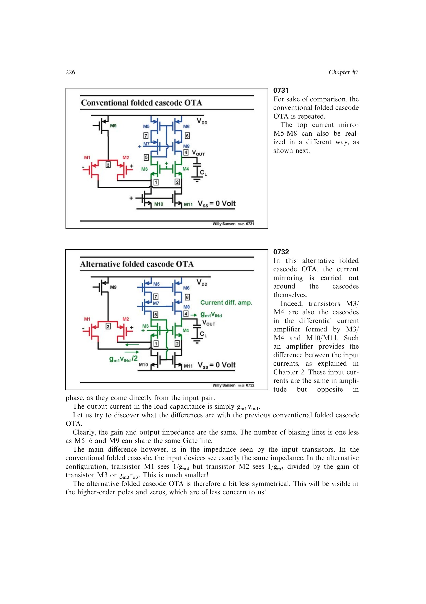

# 环绕级联镜像折叠 OTA

这种折叠 OTA 把电流镜环绕在级联管 M3/M4 与 M10/M11 上，利用差分电流放大器直接取两路反相信号电流之差。它与常规折叠 OTA 有相同的低频增益和输出阻抗，并少用一条偏置线。

代价是输入两侧看到的阻抗不同：一侧约为 (1/g_{m4})，另一侧还要除以 (g_{m3}r_{o3})，高阶极零点的对称抵消因而较差。

来源：第 7 章 p. 226，0731-0732。

## 原书图示

