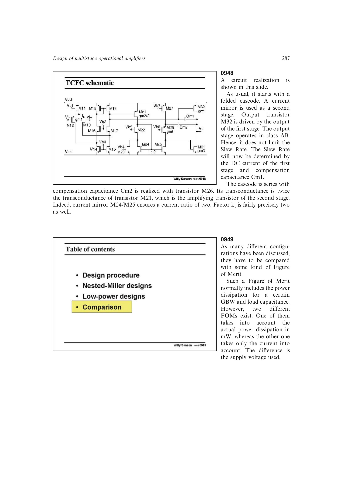

# 低功耗补偿比较

统一实验比较显示：无补偿结构不适合稳定三级运放；传统 NMC 变体只能有限改善；真正的大幅收益来自能生成左半平面零点、抵消主要非主极点且避免输出级电容分流的结构。

相对传统 NMC 的同负载、同功耗 GBW，NGRNMC 约为 `6.8` 倍，PFC 约为 `6` 倍，ACBC 约为 `17` 倍，TCFC 约为 `41` 倍。瞬态过冲仍受具体极零偏差影响，不能仅凭标称 Butterworth 配置断定。

来源：第 9 章 pp. 287-290，0949-0954。

## 原书图示

