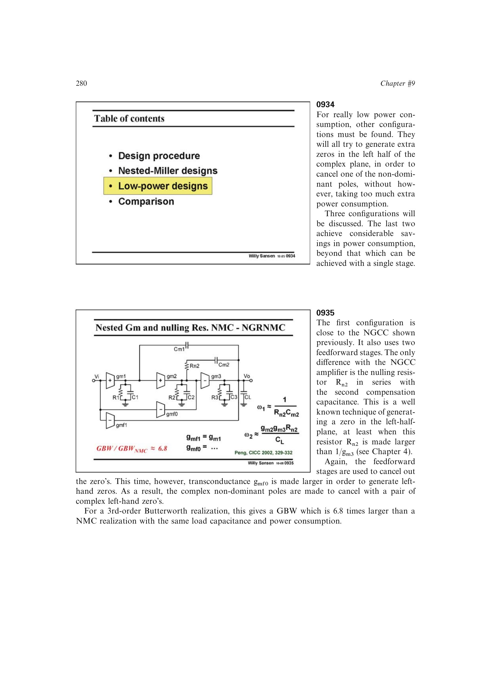

# 低功耗补偿原理

高效三级补偿的共同目标是让补偿电容不再直接分流输出级，并用左半平面零点抵消一个主要非主极点。剩余的有利左半平面零点放在下一个非主极点附近，可提供相位超前而不必用大末级跨导把所有极点硬推到高频。

书中的高效结构通常表现为四极点三零点；新增极点并非自动有害，关键在极零次序、抵消关系和最小未抵消极点相对 GBW 的位置。

来源：第 9 章 pp. 280-290，0934-0954。

## 原书图示

