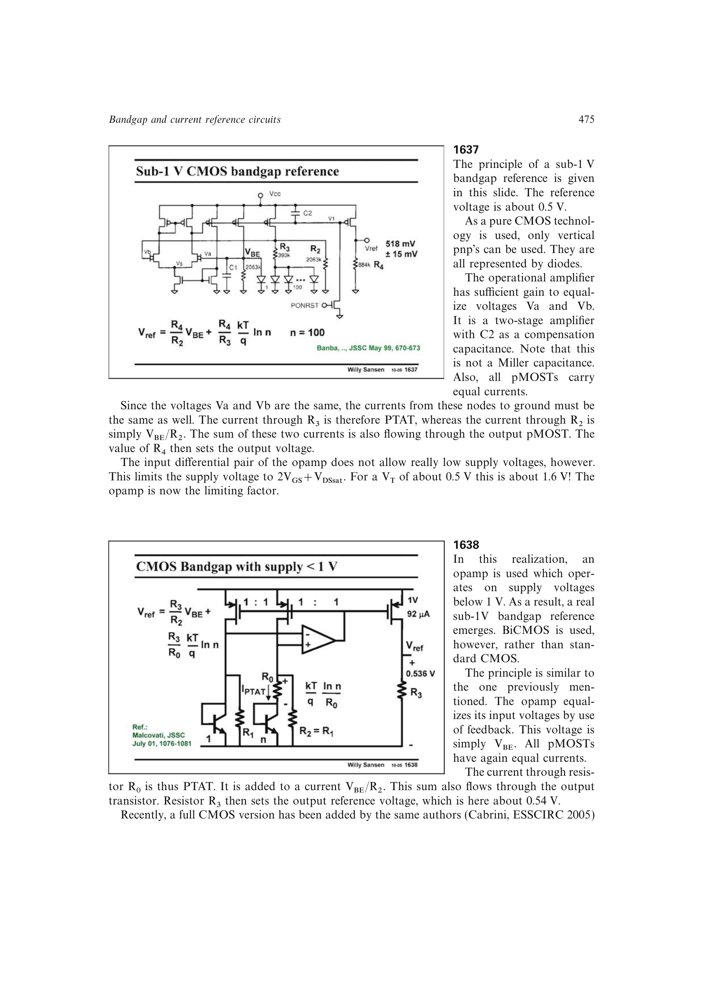

# 低压带隙基准运放

亚 1 V 带隙常被运放而非基准核心限制。普通差分输入会要求约 `2VGS+VDSsat`；伪差分 BiCMOS 输入把输入管与基准 npn 组成电流镜，可降到约 `VGS+VDSsat`，源书示例约 0.9 V。

标准 CMOS 可用输入范围覆盖地的折叠级联运放，或配合低压电流镜的对称 OTA。设计必须同时满足输入共模范围、环路增益、补偿、启动和电源余量。

来源：第 16 章 pp. 475-477，1637-1642。

## 原书图示

