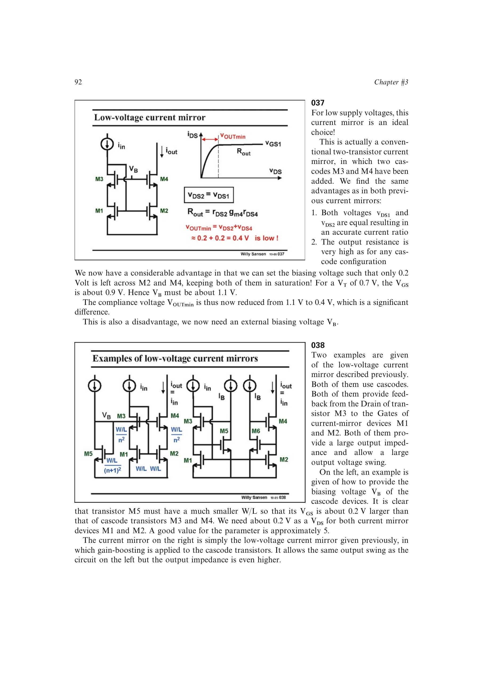

# 低压级联电流镜

低压 cascode 镜用外部偏置把镜像管和级联管各自的 `VDS` 压到刚好保持饱和的 `VOV`。若 `VOV=0.2 V`，最低输出电压可从传统约 1.1 V 降到约 0.4 V，同时保持电压匹配和高输出电阻。

偏置可由尺寸不同的辅助管产生，也可配合增益提升进一步提高输出阻抗。代价是需要可靠的额外偏置电压和正确的工作区裕量。

来源：第 3 章 pp. 92-93，037-038。

## 原书图示

