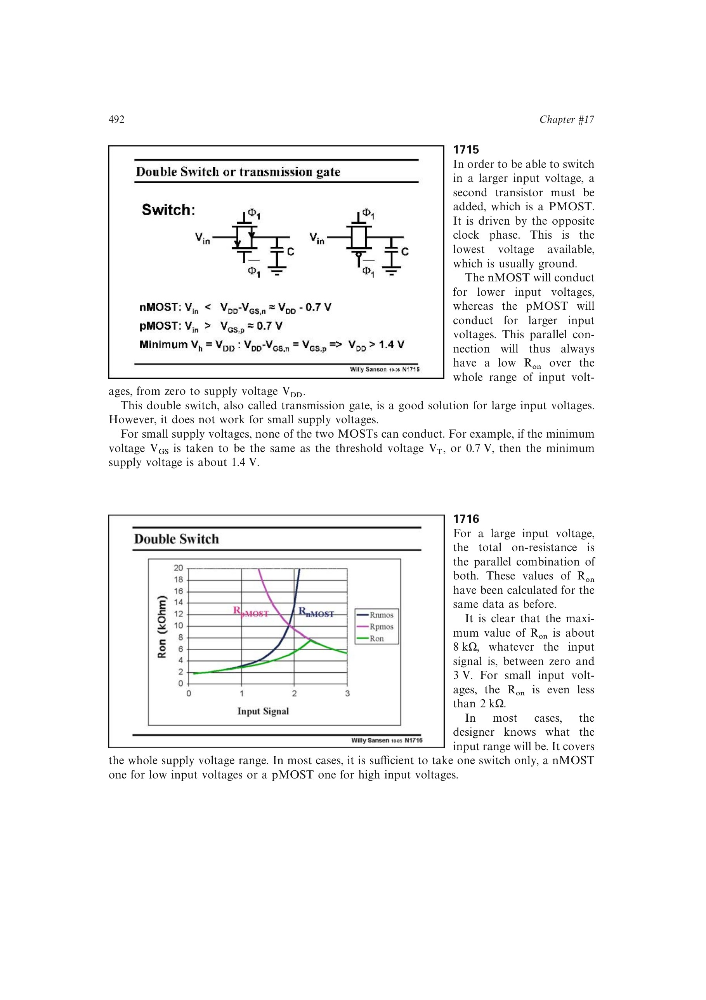

# 低压传输门死区

当电源电压小于约 `VTn+|VTp|` 时，传输门中部会出现 nMOST 与 pMOST 都没有足够过驱动的输入区间，导通电阻急剧上升。源书示例中两个阈值都接近 0.9 V 时，约 1.8 V 以下的供电已不能保证全范围导通。

这是低压开关的余量限制，不会仅靠并联互补器件消失。

来源：第 17 章 pp. 492-493，图 17.15-17.18。

## 原书图示

