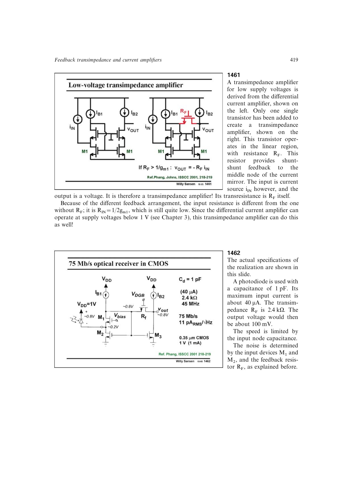

# 低压跨阻放大器

在低压差分电流放大器的电流镜中间节点加入一只线性区 MOS 作为 `RF`，即可形成并并联跨阻路径。若 `RF>1/gm1`，则 `vout=-RF*iin`，输入阻抗约 `1/(2gm1)`。

该实现继承差分电流放大器低于 1 V 的供电能力；速度受输入电容限制，噪声由两只输入器件和反馈电阻共同决定。

来源：第 14 章 pp. 419-420，1461-1462。

## 原书图示

