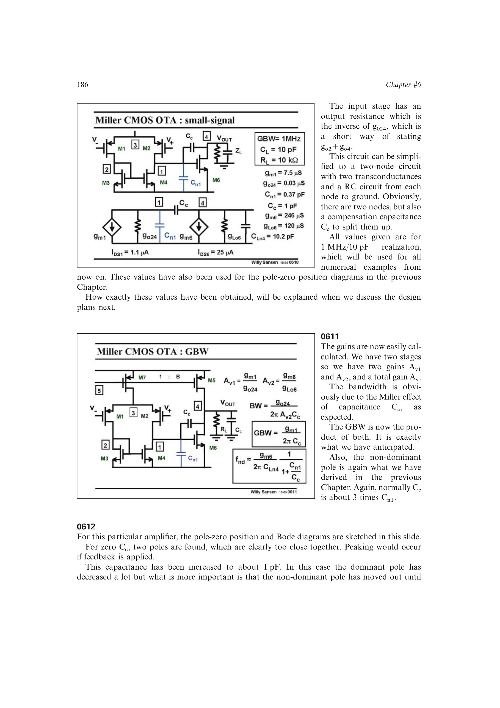

# Miller OTA 功耗品质因数

两级 CMOS Miller OTA 也用 `GBW*C_L/I_total` 比较功耗效率。书中 1 MHz、10 pF 的统一例子总电流约 27 uA，FOM 约 370 `MHz*pF/mA`；对两级结构，超过 100 已属良好。

它低于单级 OTA，因为稳定性要求第二级跨导远大于输入级，额外电流用于把非主极点推离 GBW。

来源：第 6 章 pp. 186-188，0610-0614。

## 原书图示

