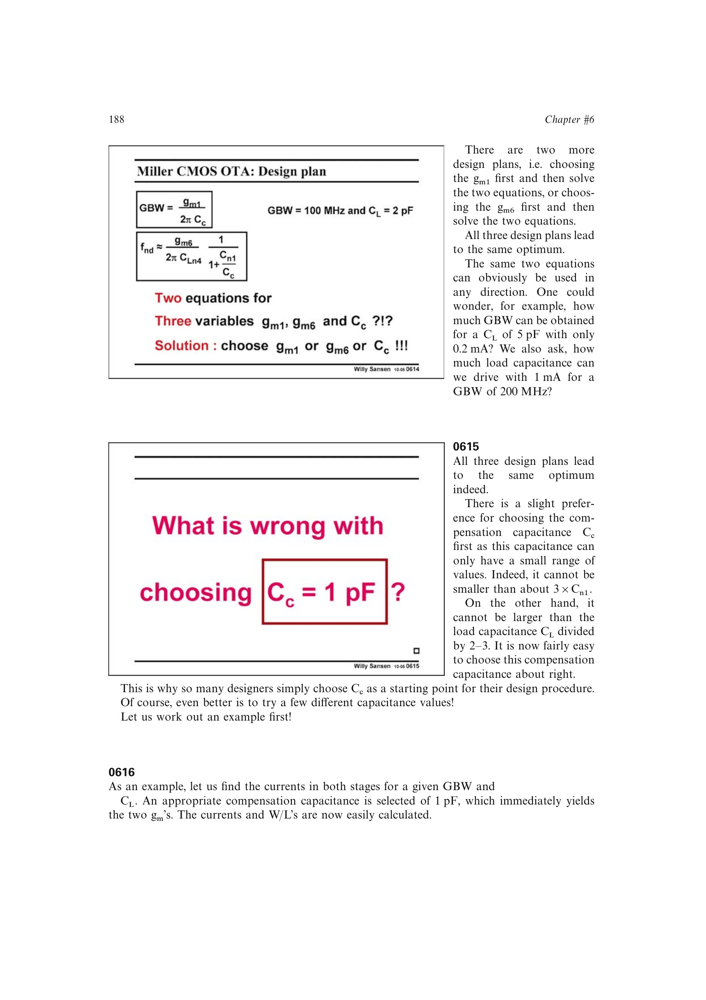

# Miller OTA 功耗最优点

固定 `GBW` 与 `C_L` 时，增大 `C_c` 会按 `GBW=g_m1/(2pi C_c)` 提高输入级 `g_m1`，却允许稳定性所需的第二级 `g_m6` 下降。两项电流一升一降，总电流因此存在最小值。

功耗曲线在最小值附近较平坦；`C_c` 取 `C_L` 的 1/2–1/3 常位于最优点左侧，略牺牲功耗却满足内部电容约束并保留设计余量。

来源：第 6 章 pp. 188-191，0614-0619。

## 原书图示

