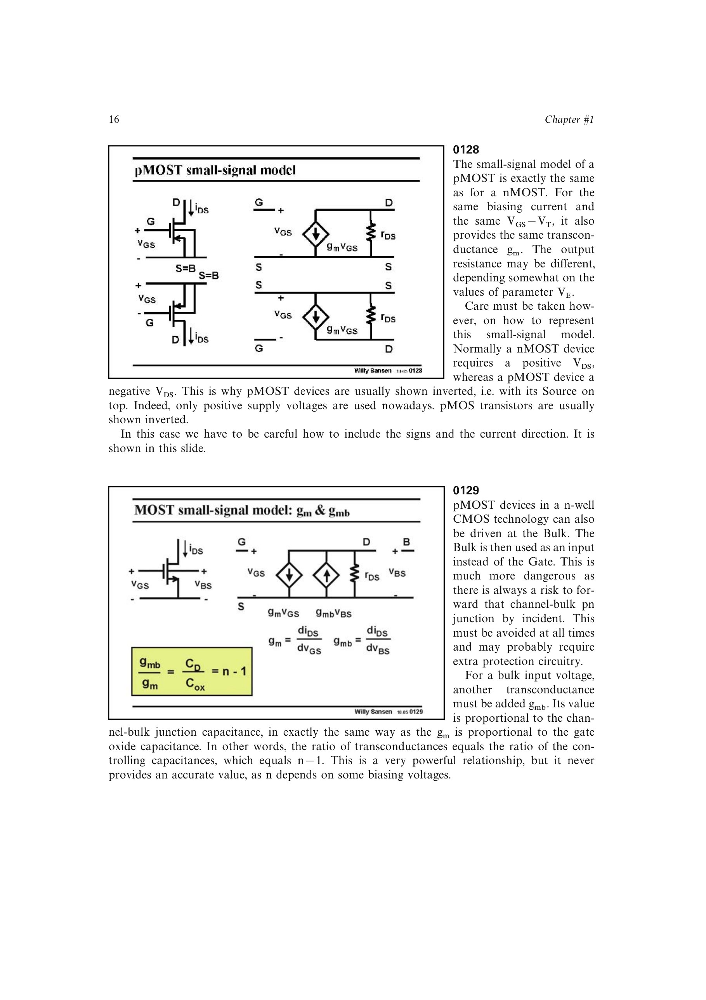

# MOST 体跨导

体端电压也会通过耗尽层电容调制沟道电流，因此小信号模型包含体跨导 `gmb`。源书给出关系

`gmb/gm = CD/Cox = n - 1`。

体端驱动的效率低于栅端驱动，且 `n` 随偏置变化，所以该关系适合估算而非精密计算。n-well 中的 pMOST 可以体端作输入，但必须避免体-沟道 pn 结意外正向偏置。

来源：第 1 章，书页 16-17，幻灯片 0129。

## 原书图示

