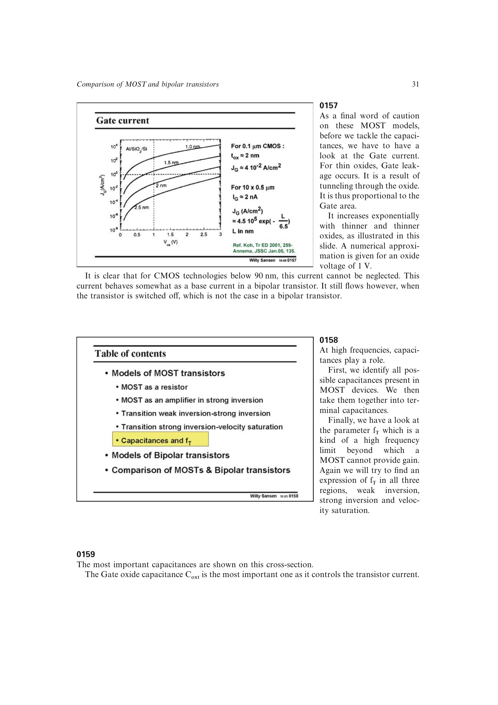

# MOST 寄生电容网络

MOST 的高频模型包含栅源 `CGS`、栅漏 `CGD`、源体 `CSB` 和漏体 `CDB` 等电容。总栅氧电容约为 `WL*Cox`；饱和区内沟道在漏端夹断，内在 `CGS` 约为其 `2/3`，再加栅源重叠电容后，源书把 `CGS ~= WL*Cox` 作为方便的手算平均值。

在最小沟道长度且 `tox ~= L/50` 的源书工艺近似下，`CGS` 约为 `2W fF`（`W` 以 um 计）。源体和漏体电容是反偏结电容，随结电压变化；共源级中 `CDB` 直接位于输出端，通常比被交流短路的 `CSB` 更关键。极高频时还要用测得的 S 参数拟合分布栅电阻与附加电容。

来源：第 1 章，书页 31-37，幻灯片 0158-0169。

## 原书图示

