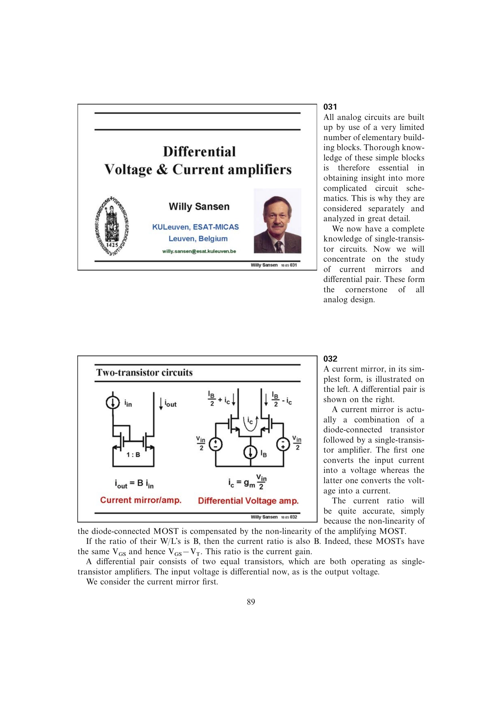

# MOST 电流镜

基本 MOST 电流镜由二极管连接输入管和共源输出管组成。两管栅源电压相同；若工艺、温度和沟道长度相同，平方律中的非线性在电流-电压和电压-电流两次转换中相互抵消，得到 `Iout/Iin = (W/L)out/(W/L)in = B`。

它既用于复制 DC 偏置，也可作为宽带电流放大器。理想比例只在两管工作区一致且沟道长度调制可忽略时成立。

来源：第 3 章 pp. 89-91，032-035。

## 原书图示

