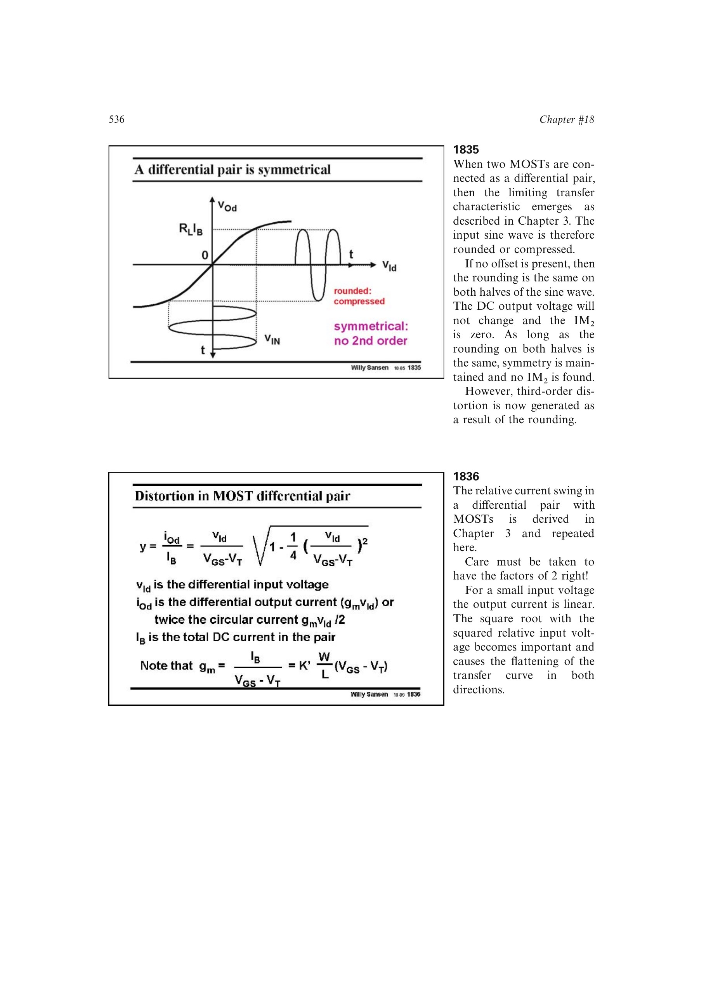

# MOST 差分对失真

理想匹配 MOST 差分对的归一化传输在小信号区近似为

`y ~= u - (1/8)u^3`。

对称性给出 `IM2=0`，三阶互调为 `IM3=(3/32)U^2`，工程上约写成 `0.1U^2`；对应 `IP3 ~= 3.3*(VGS-VT)`。结果只覆盖输入对本身，不包含电流镜、负载和输出电导的附加失真。

来源：第 18 章 pp. 536-537，图 18.38-18.40。

## 原书图示

