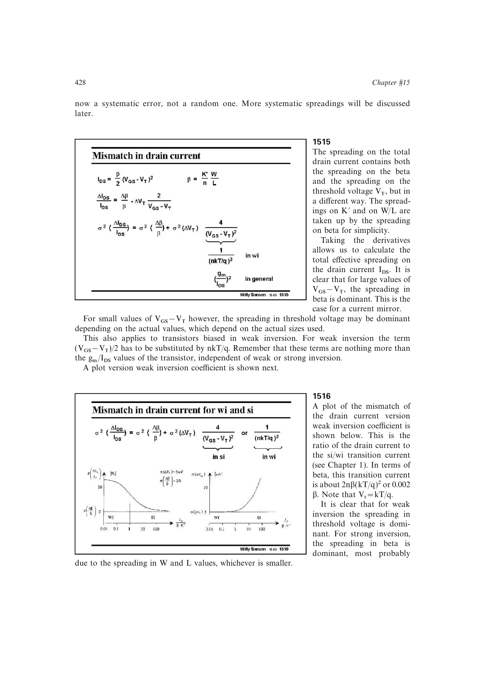

# 漏电流失配的工作区主导项

把 `beta=K'W/L` 的散布与阈值散布视为独立随机量，可得

`sigma^2(Delta IDS/IDS) = sigma^2(Delta beta/beta) + sigma^2(Delta VT)*(gm/IDS)^2`。

强反型时第二项等价于 `4*sigma^2(Delta VT)/VOV^2`，弱反型时为 `sigma^2(Delta VT)/(nUT)^2`。弱反型通常由阈值失配主导；深强反型则更容易由 `beta`、尤其较小几何尺寸的误差主导。

来源：第 15 章 pp. 428-429，1515-1516。

## 原书图示

