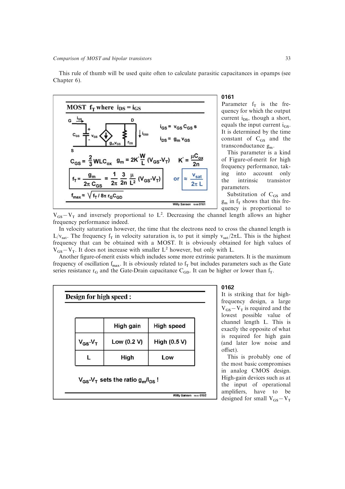

# MOST 截止频率 fT

`fT` 定义为输出短路时电流增益降为 1 的频率。一阶内在模型给出

`fT = gm/(2*pi*CGS)`。

在强反型长沟道近似中，`fT` 随 `VOV/L^2` 增大；在速度饱和极限中，载流子渡越时间决定 `fT ~= vsat/(2*pi*L)`，只按 `1/L` 缩放。弱反型中高 `gm/ID` 并不意味着高绝对速度，`fT` 会随深弱反型下降，但纳米级短沟道仍可能保有可用带宽。

来源：第 1 章，书页 33-36，幻灯片 0161-0167。

## 原书图示

