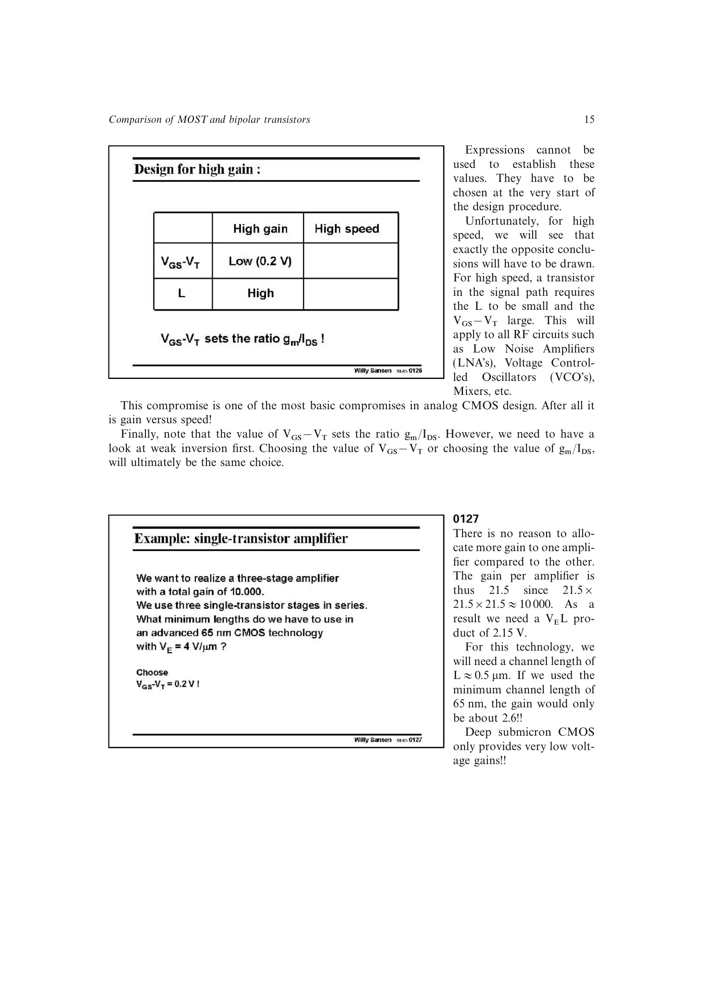

# CMOS 增益-速度折衷

MOST 的本征增益偏好长 `L`、小 `VOV`；截止频率偏好短 `L`、较大 `VOV`。这不是偶然的经验冲突，而是同一组器件方程给出的相反方向。

因此，运放输入级等高增益器件常取 `VOV` 约 0.15-0.2 V、`L` 为最小长度的数倍；RF 信号通路常取约 0.5 V 和最小 `L`。具体数值是源书的手算起点，最终仍需按工艺模型与规格验证。

来源：第 1 章，书页 15、33-36，幻灯片 0126、0162-0167。

## 原书图示

