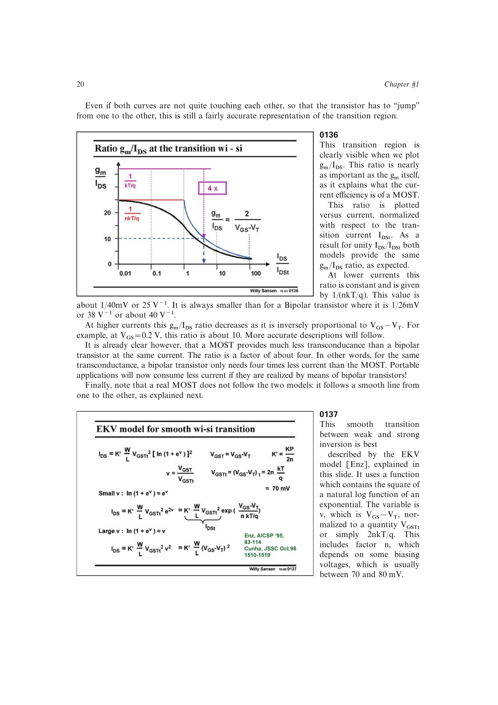

# 跨导电流效率 gm/ID

`gm/ID` 表示每单位偏置电流得到多少跨导，是模拟设计中的电流效率指标。弱反型极限为 `1/(nUT)`；理想强反型平方律给出 `2/VOV`，实际平滑模型在中等反型附近低于这个简单外推。

源书的 EKV 曲线显示，`VOV` 约 0.2 V 时实际 `gm/ID` 约 4.2 V^-1；减小到 0.15 V 或 0.1 V 可分别提高到约 5.4 和 7 V^-1。双极型器件的理想值约为 `1/UT ~= 40 V^-1`。

来源：第 1 章，书页 20-23，幻灯片 0136、0140-0141。

## 原书图示

