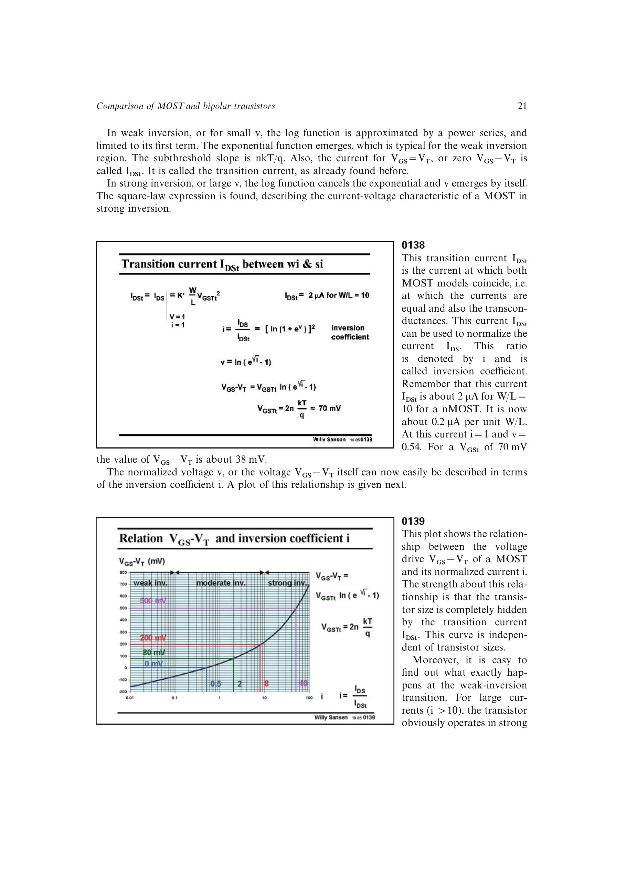

# 反型系数

反型系数把漏电流按过渡电流归一化：`i = IDS/IDSt`。它消除了 `W/L` 的显式影响，可用一个无量纲量描述器件离弱反型、强反型或两者之间有多远。

源书采用的经验区间是：`i < 0.1` 为明确弱反型，`0.1 < i < 10` 为中等反型，`i > 10` 为明确强反型。`VGS=VT` 时电流约为 `0.5 IDSt`；实际分区是连续的，边界只用于设计沟通和初算。

来源：第 1 章，书页 21-22，幻灯片 0138-0139。

## 原书图示

