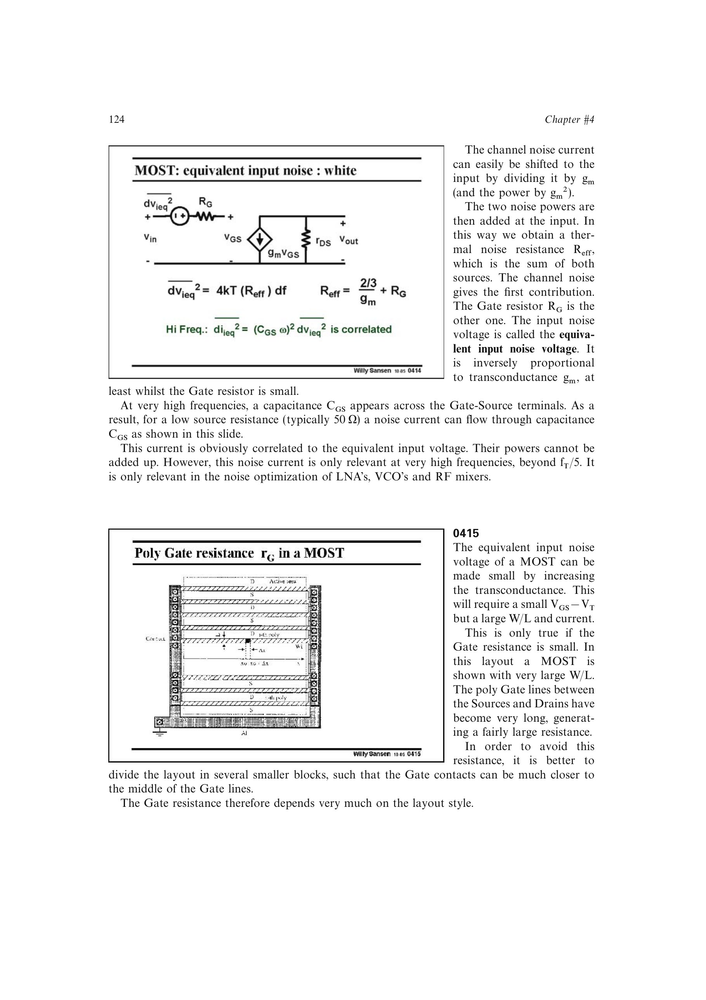

# MOST 版图噪声预算

大型输入 MOST 除沟道噪声外，还受栅、衬底和源区串联电阻影响。输入折算热噪声预算可概括为 `4kT[gamma/g_m + R_G + (g_mb/g_m)^2 R_B + R_S]`。

多指栅与密集栅接触可减小 `R_G`，宽而近的衬底接触可减小分布式 `R_B`。器件面积变大并不自动保证低噪声，必须同时控制这些版图电阻。

来源：第 4 章 pp. 124-127，0415-0419。

## 原书图示

