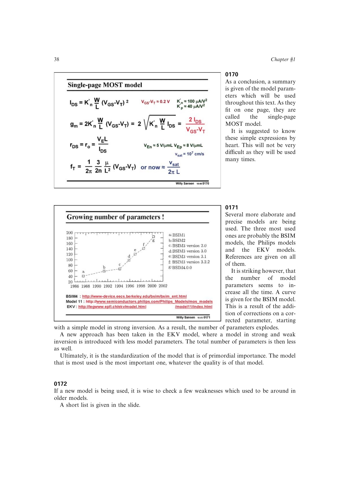

# MOST 模型验证准则

一个用于模拟设计的新 MOST 模型至少应检查：弱反型到强反型、强反型到速度饱和的电流及一阶导数连续性；线性区到漏源饱和区、`VDS=0` 附近的连续性；失真分析所需的二阶与三阶导数连续性；噪声模型的一致性。

高频设计还应把由模型得到的输入阻抗 `s11` 和增益 `s21` 随频率曲线与测量对照，必要时检查全部 S 参数。参数数量增长不等于模型质量自动提高；标准化、适用范围和可验证性同样重要。

来源：第 1 章，书页 38-39，幻灯片 0170-0172。

## 原书图示

