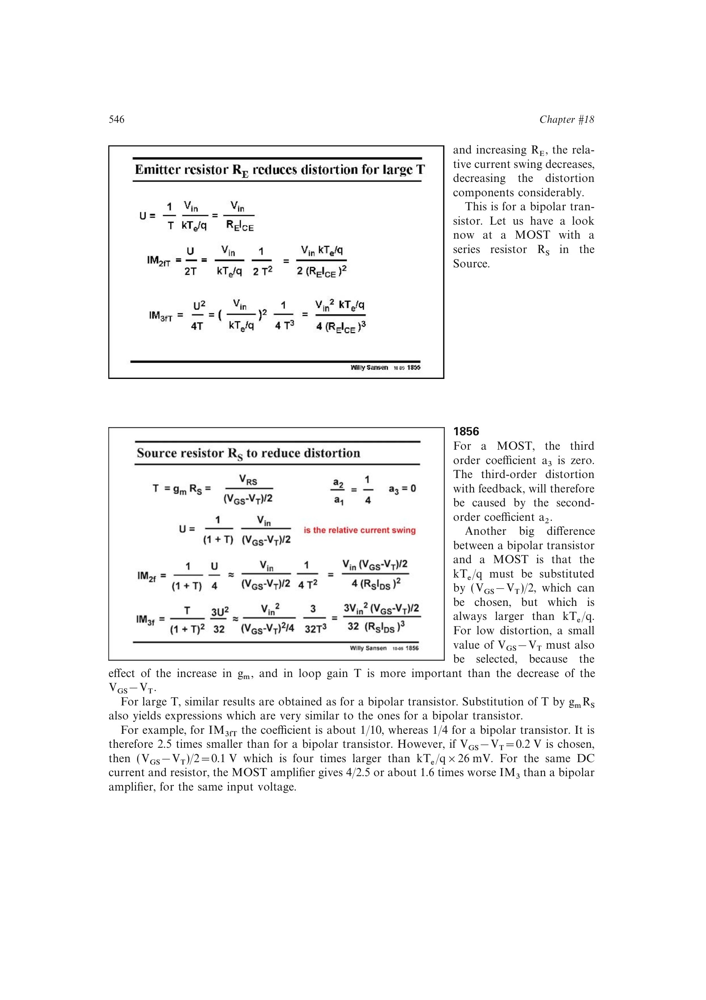

# MOST 源极退化失真

MOST 源极串联 `RS` 形成 `T=gm*RS` 的局部反馈。内部相对电流摆幅因反馈减小，生成的失真又被环路增益抑制；理想平方律管的闭环三阶项主要来自二阶项在环路中的再循环。

与 BJT 相比，电压归一化尺度由 `UT` 换成 `(VGS-VT)/2`。增大 `RS` 能改善线性度，但同时降低跨导、占用压降并增加噪声。

来源：第 18 章 pp. 546-547，图 18.56-18.58。

## 原书图示

