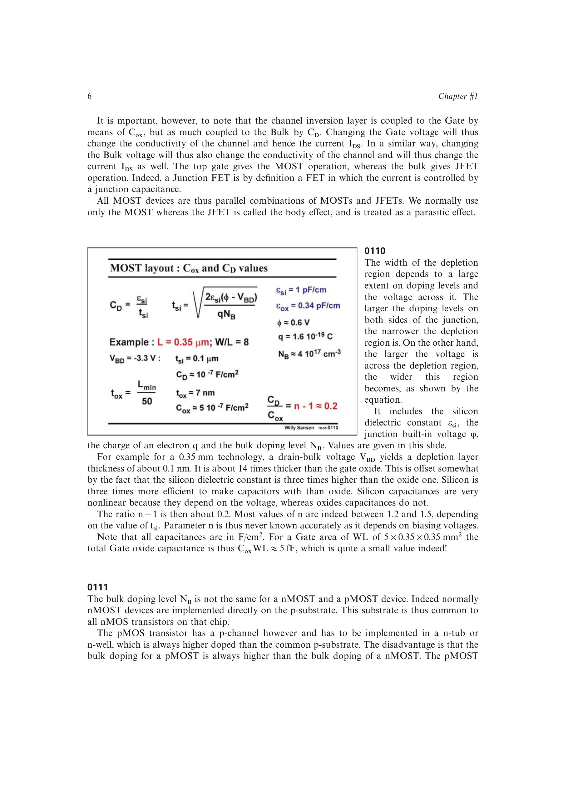

# MOST 阈值电压

阈值电压 `VT` 是建立强反型沟道所需的栅源电压基准。设计中常使用过驱动电压 `VOV = VGS - VT`，因为它直接指示工作区、跨导电流效率和饱和所需压降。

`VT` 不是绝对常数：它随体源反偏变化，并受工艺、温度和器件尺寸影响。源书的简化模型把零体偏阈值记作 `VT0`，再用体效应修正。

来源：第 1 章，书页 6-11，幻灯片 0110-0119。

## 原书图示

