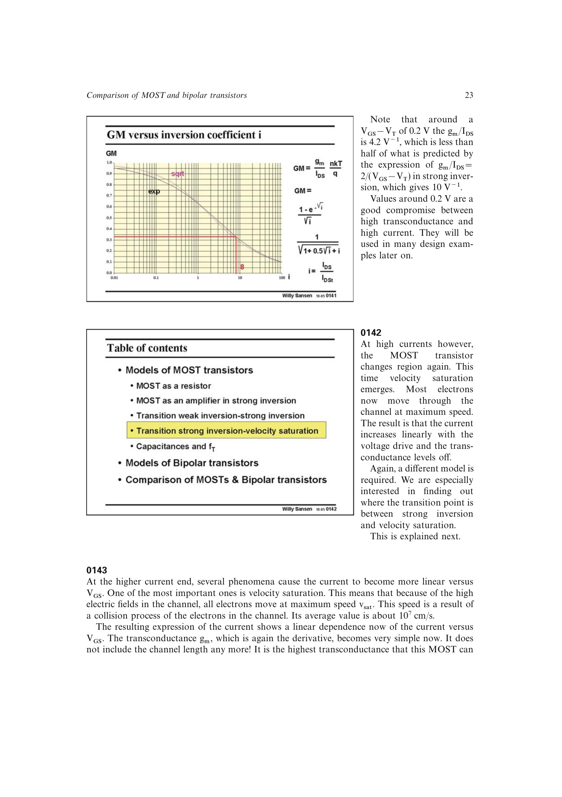

# 速度饱和模型

高横向电场使载流子平均速度接近 `vsat`（电子约 `10^7 cm/s`），此时漏电流对过驱动由平方关系转为近似线性：

`IDS ~= W*Cox*vsat*(VGS-VT)`，因此 `gm,sat ~= W*Cox*vsat`。

跨导达到由宽度、氧化电容和物理速度上限决定的平台，继续增加电流不再带来相应跨导增益，所以模拟设计通常不把深速度饱和作为高效工作点。源书也用参数 `theta` 把迁移率退化等高场线性化效应一并写入分母。

来源：第 1 章，书页 23-26，幻灯片 0142-0147。

## 原书图示

