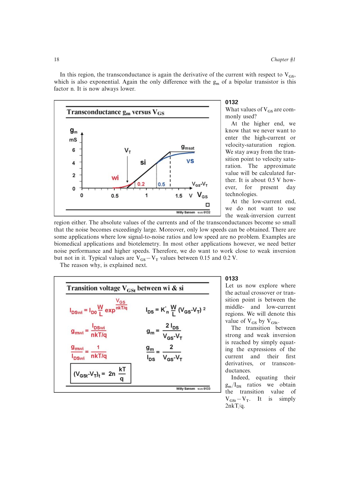

# 弱反型-强反型过渡

把弱反型与强反型模型的电流及一阶导数在交界处匹配，可得过渡过驱动电压

`VOV,t = 2nUT`，室温下约 70-80 mV。

对应过渡电流为 `IDSt = Kinf(W/L)(2nUT)^2`。过渡电压基本不依赖沟道长度，过渡电流却与 `W/L` 成正比。两种分段模型只近似相接，真实器件在中等反型区平滑过渡。

来源：第 1 章，书页 18-20，幻灯片 0133-0136。

## 原书图示

