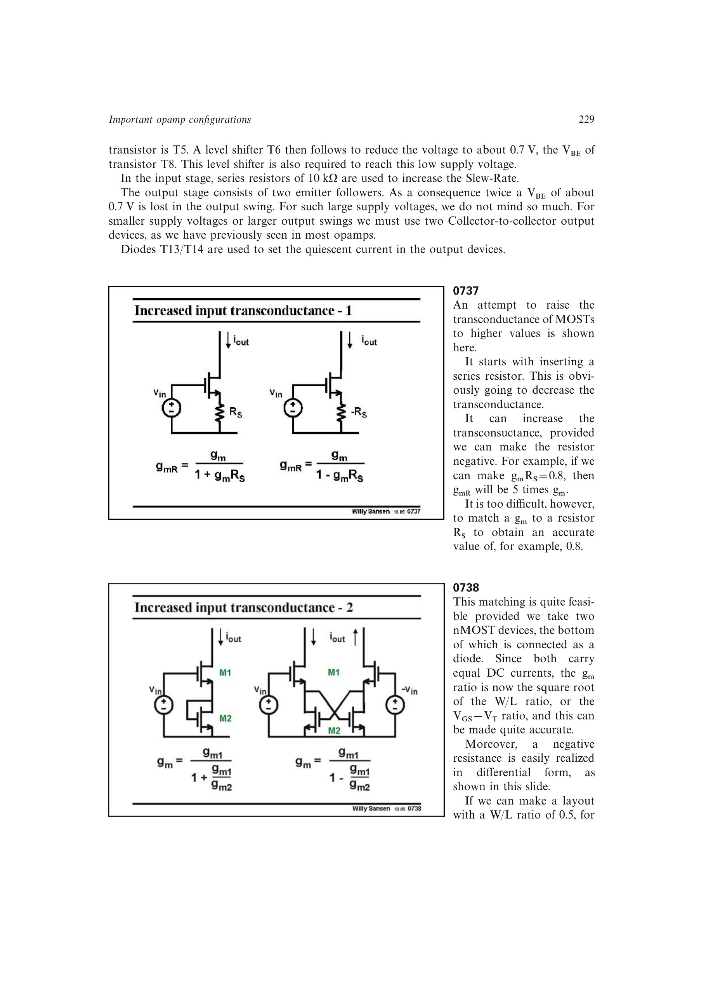

# 负电阻跨导增强

源极串联正电阻使有效跨导变为 (g_m/(1+g_mR_S))；若差分形式实现负电阻，则变为

[
g_{mR}=rac{g_m}{1-g_mR_S}.
]

用等电流、匹配尺寸的 MOST 形成交叉耦合负电阻，可以把关键比值转化为器件跨导比。例中 (W/L) 比为 0.5 时，跨导比约 0.71，可把有效跨导提高约 3 倍。

来源：第 7 章 pp. 229-230，0737-0738。

## 原书图示

