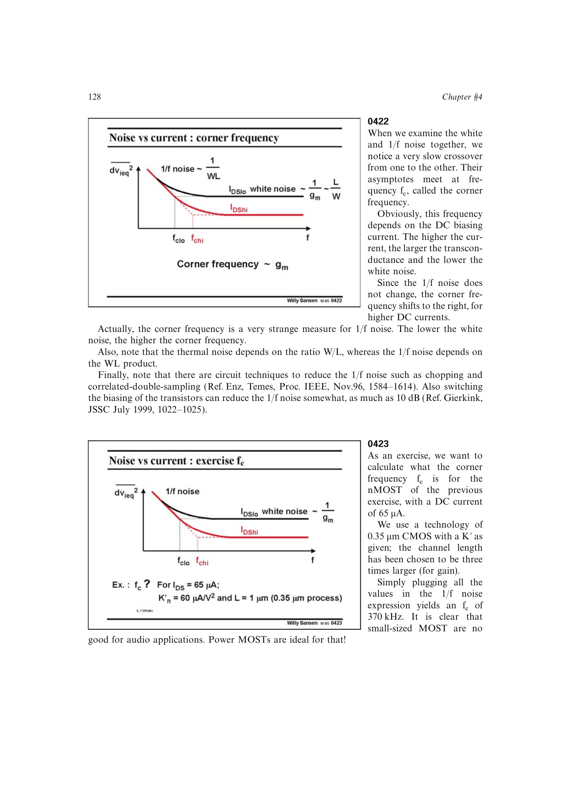

# 噪声拐角频率

白噪声平台与 `1/f` 噪声渐近线相交处定义拐角频率 `f_c`。提高偏置电流会增大 `g_m`、降低白噪声，而近似不改变输入折算 `1/f` 噪声，因此反而会把 `f_c` 推向更高频率。

所以较高的 `f_c` 不一定表示器件的闪烁噪声更差；它也可能只是白噪声更低。热噪声主要受 `W/L` 影响，闪烁噪声主要受 `WL` 影响。

来源：第 4 章 p. 128，0422-0423。

## 原书图示

