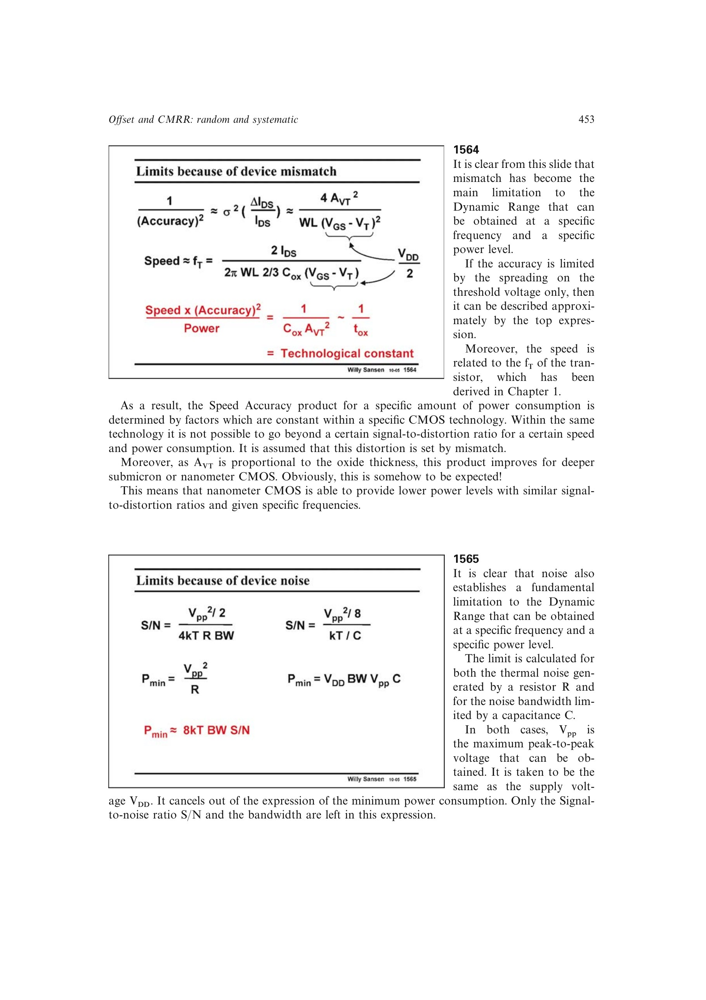

# 噪声限制的最小功耗

对电阻热噪声限制的带宽，`S/N=(Vpp^2/2)/(4kTRBW)` 且 `Pmin=Vpp^2/R`；对 `kT/C` 限制，`S/N=(Vpp^2/8)/(kT/C)` 且充放电功耗与 `VDD*Vpp*CBW` 成正比。

取 `Vpp` 与 `VDD` 同阶后，两条路线都归结到数量级

`Pmin ~= 8kT*BW*(S/N)`。

因此噪声极限下，最小功耗主要由目标带宽和信噪比决定，最大摆幅在一阶推导中消去。

来源：第 15 章 p. 453，1565。

## 原书图示

