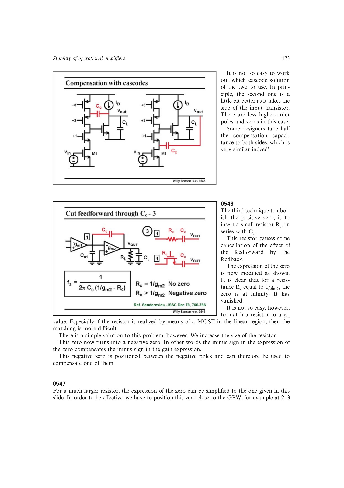

# 调零电阻补偿

在 `C_c` 串联电阻 `R_c` 可改变零点位置。`R_c=1/g_m2` 时零点移到无穷远；再增大 `R_c`，零点进入左半平面，可放在非主极点附近提供正相位补偿。

实用设计把 `R_c` 选在 `1/g_m2` 与约 `1/(3g_m1)` 之间，对绝对误差容忍度较高，避免精确匹配一个晶体管跨导。

来源：第 5 章 pp. 173-175，0546-0548。

## 原书图示

