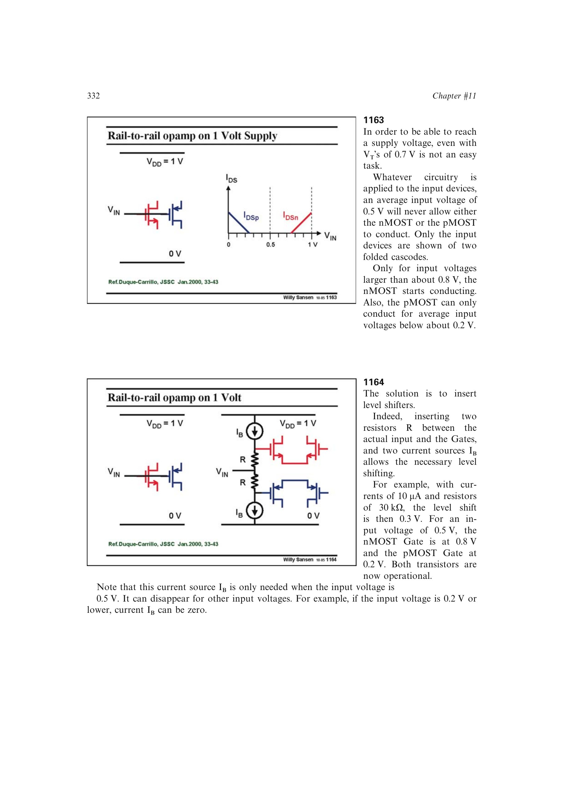

# 1 V 电平移位输入

1 V 电平移位输入在实际输入与 nMOST、pMOST 栅极之间串入电阻，并用共模相关电流产生相反方向的压降。书中 0.5 V 中点例用约 0.3 V 移位，把 nMOST 栅极抬到 0.8 V、pMOST 栅极降到 0.2 V，使常规阈值器件同时导通。

移位电流随共模呈近似三角形，只在中间区间出现。该方法能在常规 `V_T` 下工作于 1 V，但串联电阻增加热噪声，四路电流源失配产生输入偏置电流与失调电流；减小电阻又要增大电流并加剧后两者。

来源：第 11 章 pp. 332-334，1163-1167。

## 原书图示

