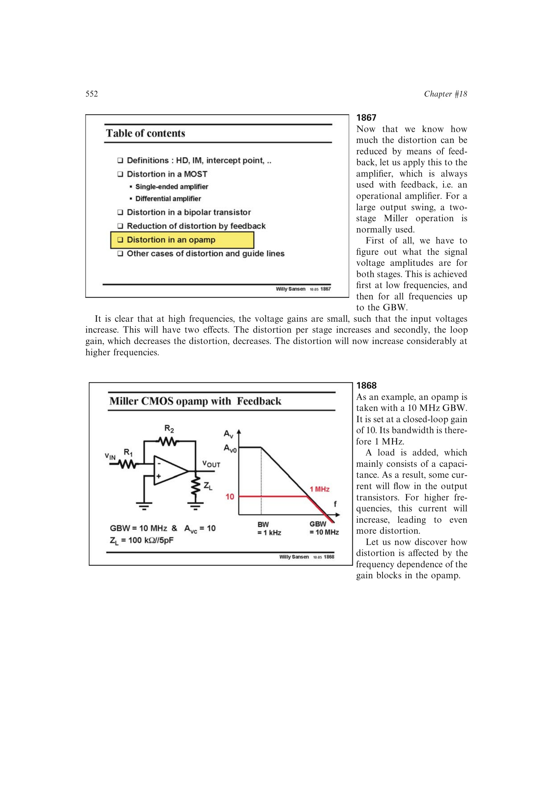

# 运放失真随频率上升

闭环输出幅度固定时，频率升高会使开环增益和环路增益下降。各级为了维持输出必须承受更大的内部输入电压与相对电流摆幅；生成的失真同时又失去环路增益抑制，因此总失真常在主极点附近开始快速上升。

分析时应逐级求该频率下的内部电压和相对电流摆幅，计算本级失真，再除以该频率的环路增益。

来源：第 18 章 pp. 552-559，图 18.72-18.82。

## 原书图示

