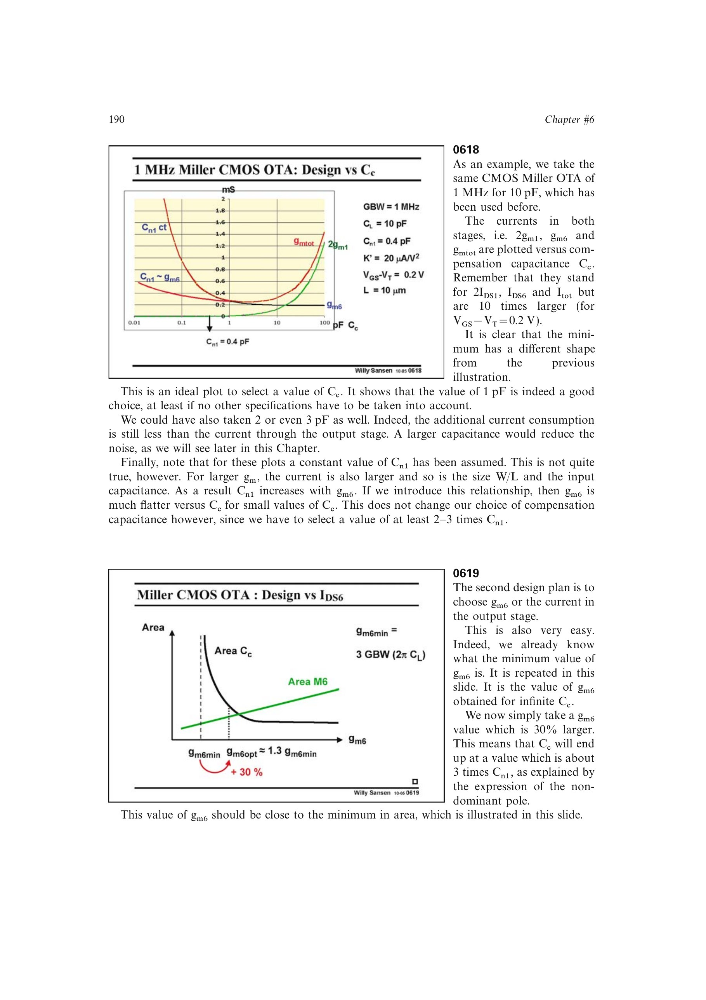

# 输出级优先尺寸流程

先选择接近最低允许值的 `g_m6`，并取比理论渐近最小值约高 30%，可优先压低占总电流最大的输出级。由 `g_m6` 和器件工作点求 `W6`、`C_GS6≈C_n1`，再由非主极点式反求 `C_c`，最后设计输入级。

这一顺序消除了“未知 `g_m6` 就不知道 `C_n1`，未知 `C_n1` 又难选 `C_c`”的循环。

来源：第 6 章 pp. 190-192、208-209，0619-0621、0653。

## 原书图示

