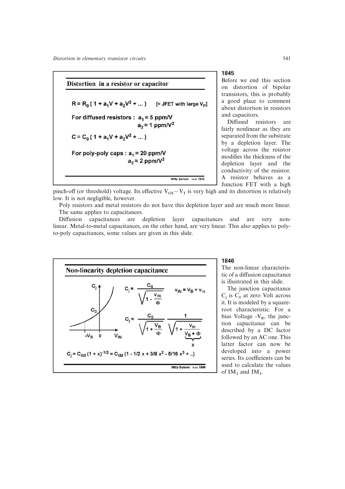

# 集成无源器件非线性

扩散电阻与衬底之间存在电压相关的耗尽层，端电压会改变有效导电截面，所以它近似表现为高夹断电压的结型场效应器件。多晶硅和金属电阻没有这种耗尽层，线性度明显更高。

相同原则适用于电容：扩散结电容高度非线性，而 poly-poly 与 metal-metal 电容通常接近线性。器件选择因此不仅影响匹配和面积，也直接进入失真预算。

来源：第 18 章 p. 541，图 18.45。

## 原书图示

