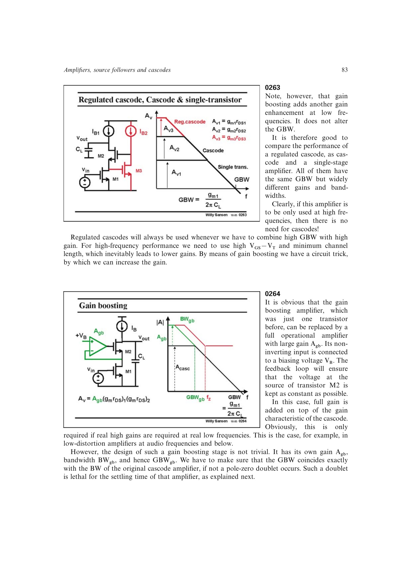

# 极零双点的建立时间代价

增益提升支路若带宽配置不当，会在主放大器通带内形成相近但未完全抵消的极点和零点。幅频曲线可能看似平坦，阶跃响应却多出一个低频、低幅但衰减很慢的指数项。

单极点系统达到 0.1% 误差约需 `ln(1000)=6.9` 个 `1/(2*pi*GBW)` 时间常数；双点的慢极点会把建立时间显著拉长。开关电容等离散时间系统因此必须避免通带内双点。

来源：第 2 章 pp. 83-84，0264-0265。

## 原书图示

