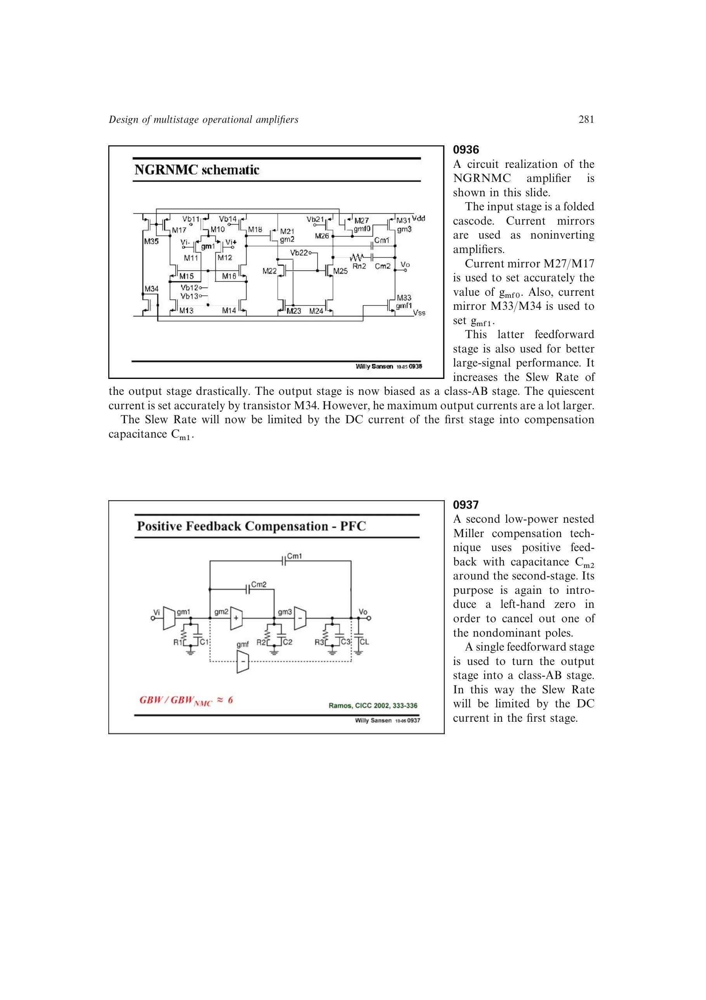

# 正反馈补偿

PFC 用第二补偿电容在第二级周围形成受控正反馈，从而生成左半平面零点并抵消第一非主极点。另一条前馈路径把输出级变为 Class-AB，使压摆率主要由第一级电流和 `Cm1` 决定。

在同负载、同功耗的三阶 Butterworth 比较中，PFC 的 GBW 约为传统 NMC 的六倍。这里的局部正反馈只服务于零点构造，整体环路仍须满足稳定性条件。

来源：第 9 章 pp. 281-282，0937-0939。

## 原书图示

