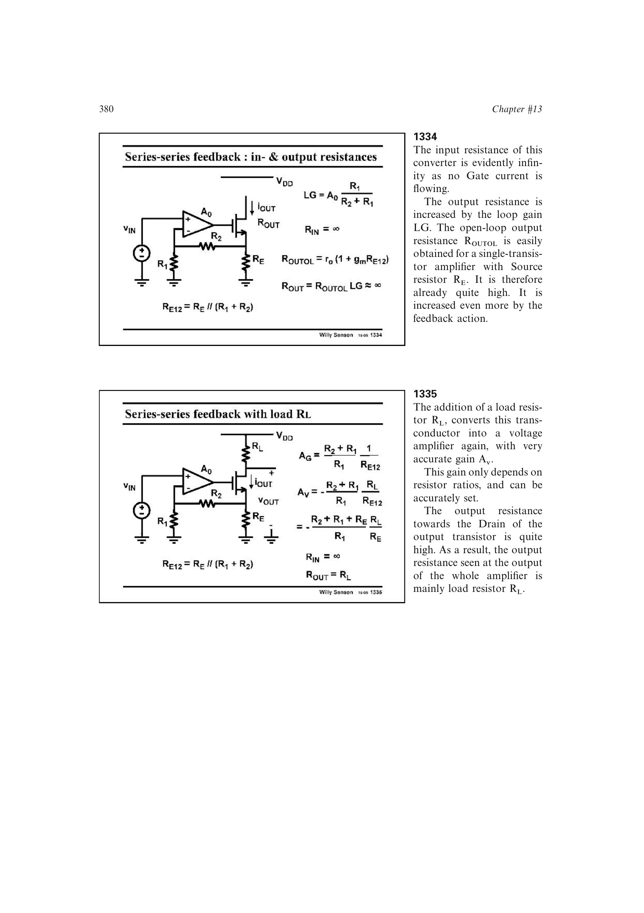

# 精密反馈电流源

把跨导器的比例电阻 `R1,R2` 省去，运放强制源极反馈电压跟随输入，得到 `iout=vin/RE`。输入阻抗近似无限，环路增益约为 `A0`，输出阻抗由 `ro*(1+gm*RE)` 再乘全局反馈因子。

该结构把器件跨导和开环增益的不确定性移出闭环电压电流比例，成为高精度、高输出阻抗的电流发生器。

来源：第 13 章 pp. 380-381，1334-1336。

## 原书图示

