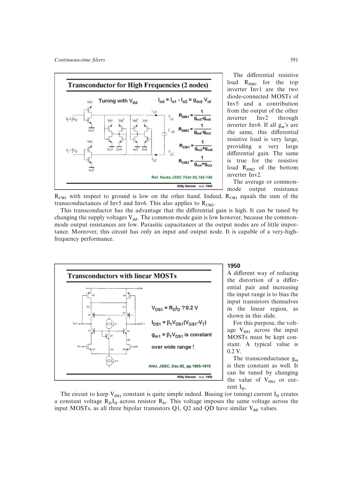

# 伪差分线性区跨导器

伪差分线性区跨导器去掉输入对尾电流源，让两支在线性区工作的 MOST 分别处理正、负输入。级联偏置保持输入管 `VDS` 近似恒定，或用线性区 MOST 反馈电阻设定电压电流转换。

省去尾源可把最低供电降低约一个 `VDSsat`，调谐范围较大；输入共模却直接设定直流电流，前级必须提供准确共模偏置。

来源：第 19 章 pp. 591-593，图 19.50-19.53。

## 原书图示

