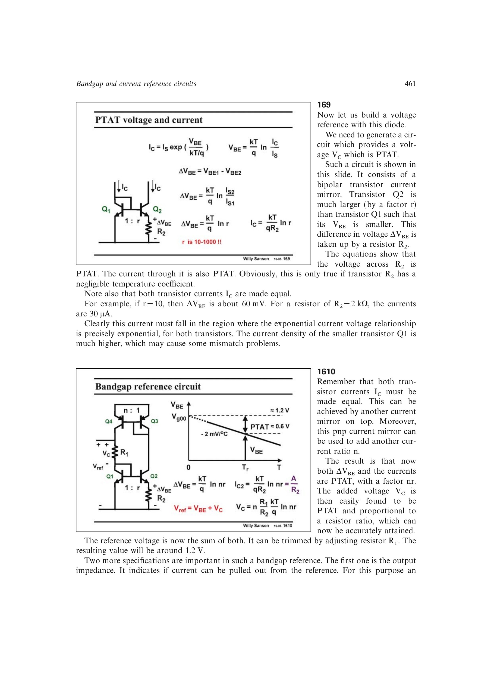

# PTAT 电流

把 `Delta VBE` 加在温度系数可忽略的一阶电阻 `R` 上，得到

`IPTAT=Delta VBE/R=UT*ln(r)/R`。

若镜像比为 `n`，则相应 PTAT 电流或其输出贡献按 `n` 缩放。电阻自身的温度系数会偏离理想 PTAT 斜率，所以实际设计必须把材料温漂纳入误差预算。

来源：第 16 章 p. 461，169-1610。

## 原书图示

