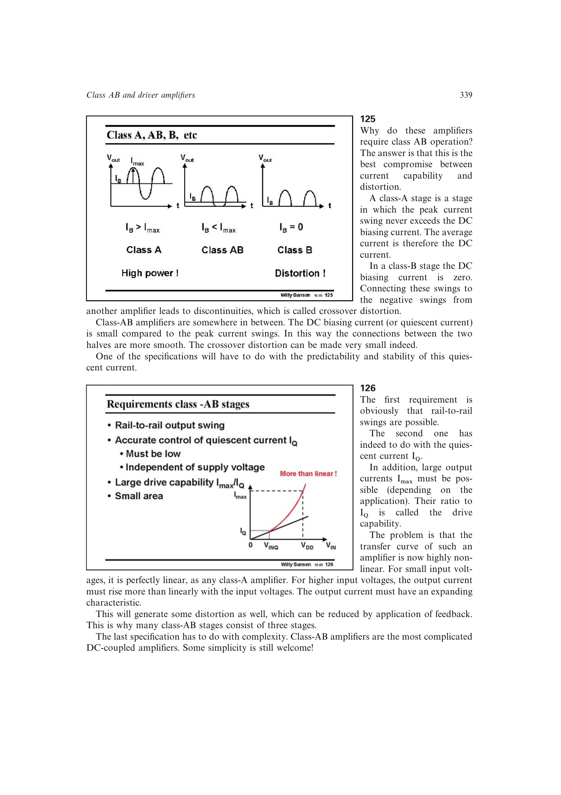

# 推挽交越失真

Class-B 推挽级静态电流为零，正、负半周在零点附近不能平滑接续，传输曲线出现不连续或死区，这就是交越失真。

Class-AB 用小而非零的静态电流保持两只输出管在交接区同时具有跨导，使过渡连续。静态电流太小、压摆率不足或一侧器件在大信号时完全关断，都会重新放大交越失真。

来源：第 12 章 pp. 339-340，125-126；pp. 350-351，1226-1228。

## 原书图示

