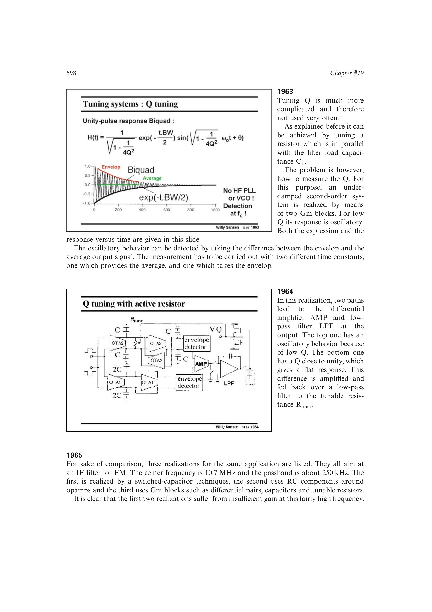

# 品质因数调谐环

Q 调谐环用待调二阶系统产生欠阻尼响应，再分别提取振荡包络与平均分量。把该响应与 Q 接近 1 的平坦参考路径比较，差值经放大和低通反馈到并联阻尼电阻，直到目标衰减形状成立。

Q 的动态测量比频率比较复杂，包络与平均检测需要不同时间常数，因此这种环路较少使用，并需防止调谐激励污染主信号。

来源：第 19 章 p. 598，图 19.63-19.64。

## 原书图示

