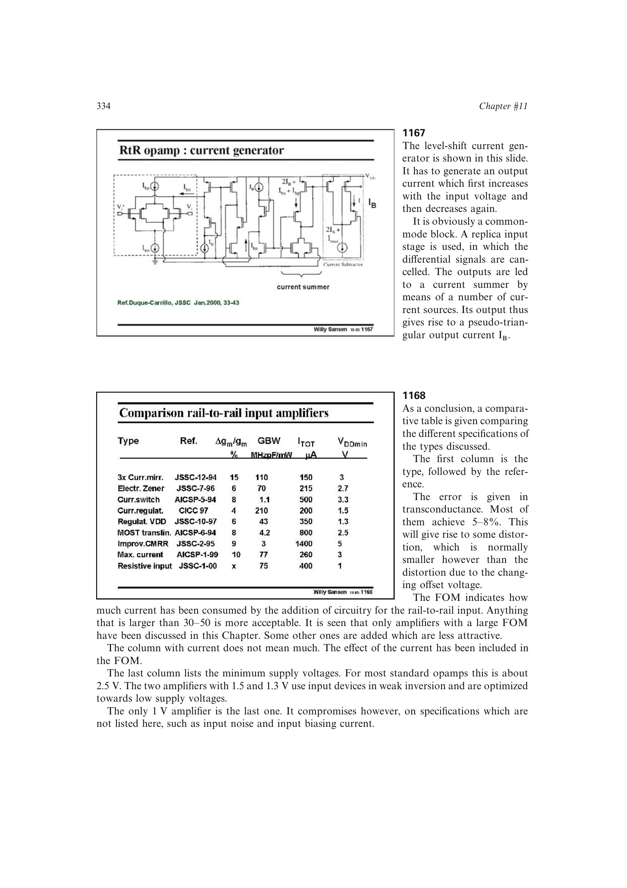

# 轨到轨输入功耗品质因数

轨到轨输入级沿用 `FOM=GBW*C_L/I_total`，单位常写作 `MHz*pF/mA`，衡量加入轨到轨处理后单位总电流支持的带宽与负载。比较表把电流影响纳入 FOM，因此不应再用总电流列单独判断效率。

第 11 章认为大于约 30-50 较可接受；但 FOM 不包含失调过渡失真、输入噪声、偏置电流、面积或供电范围，必须与这些指标共同阅读。

来源：第 11 章 pp. 334-335，1168。

## 原书图示

