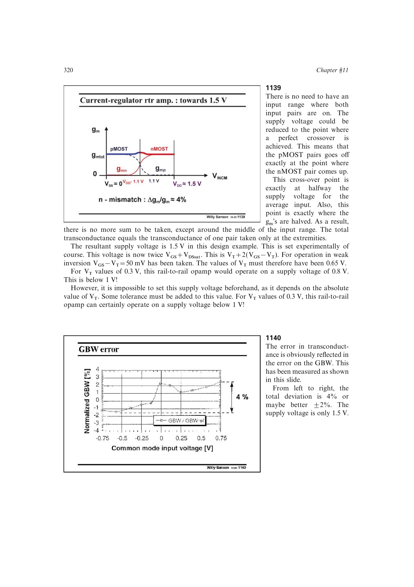

# 轨到轨输入失调过渡失真

互补轨到轨输入级随共模电压从 pMOST 对过渡到 nMOST 对。两对通常具有不同输入失调，因此等效失调会随共模变化；当大信号穿越转换区时，这个变化直接成为非线性误差。

书中 1.5 V CMOS 例的失调差约 5 mV，对 1 V 信号可形成约 0.5% 或 `-50 dB` 失真。它往往比约 4% 的 `g_m`/GBW 漂移更严重；增加重叠只能平均过渡，不能消除两对失调差。

来源：第 11 章 pp. 320-322，1140-1142。

## 原书图示

