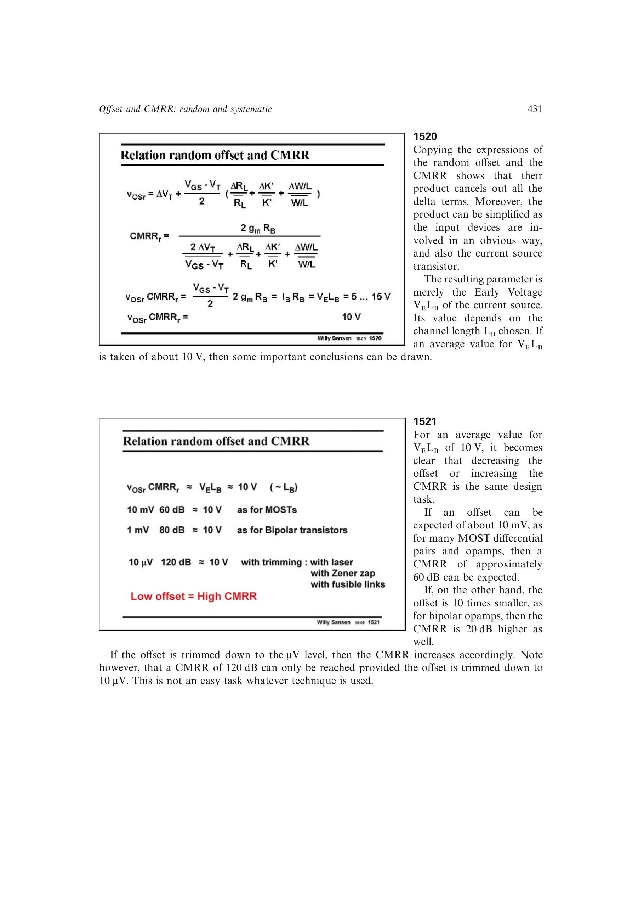

# 随机失调-CMRR 乘积约束

把差分对随机失调式与随机 CMRR 式相乘，全部失配增量会消去：

`vosr*CMRRr = (VOV/2)*2*gm*RB = IB*RB = VE*LB`。

右端是尾电流源的 Early 电压尺度，源书取典型值约 10 V。因此在同一结构中，降低随机失调与提高随机 CMRR 是同一个设计任务；10 mV 大致对应 60 dB，1 mV 对应 80 dB，10 uV 才可能对应 120 dB。

来源：第 15 章 p. 431，1520-1521。

## 原书图示

