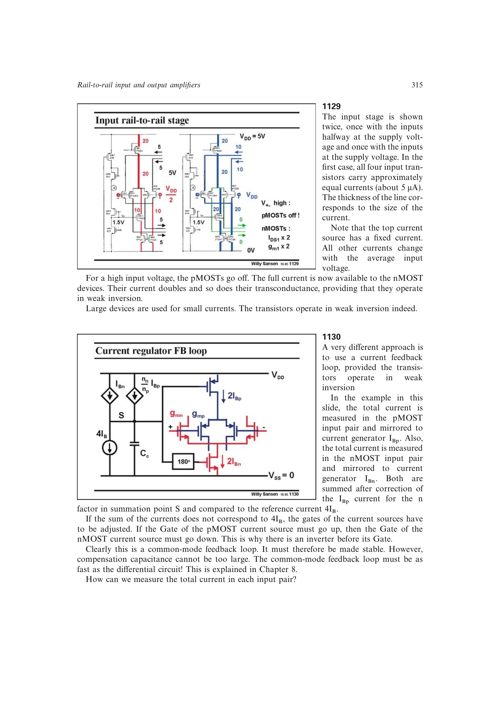

# 复制 CMFB 跨导均衡

复制 CMFB 跨导均衡分别测量 pMOST、nMOST 输入对副本的总电流，按亚阈值斜率因子 `n` 修正后求和，并与参考电流比较。误差经共模反馈同时调节两套主输入对的电流源，使总电流及弱反型总跨导在共模范围内近似恒定。

副本输出短接以消除差分信号，因而不会直接加载主信号节点。该环路必须稳定，但补偿不能把它做得比差分通道慢；书中完整放大器的 `g_m` 或 GBW 变化约为 4%。

来源：第 11 章 pp. 315-320，1130-1138。

## 原书图示

