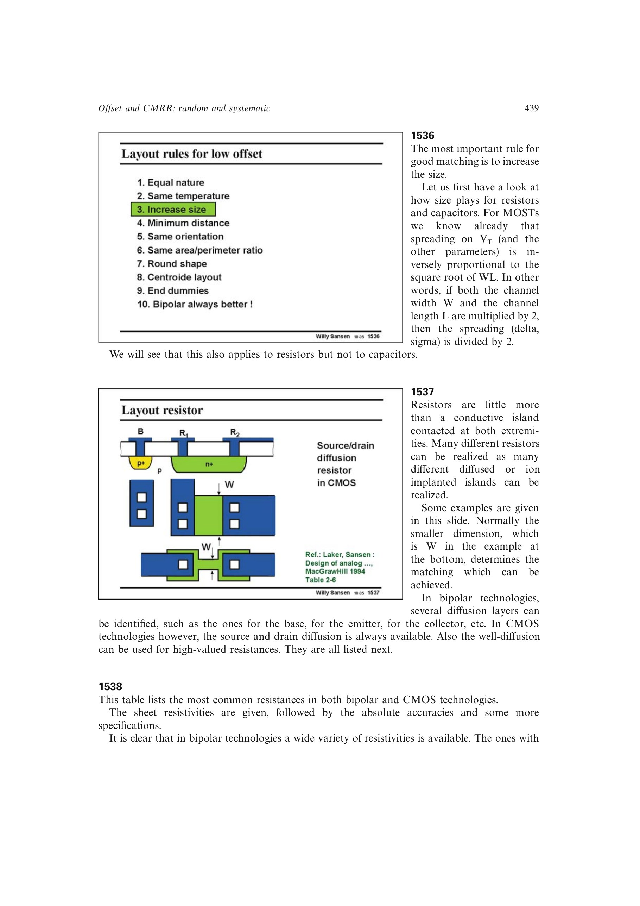

# 电阻匹配精度极限

固定 `W/L` 时，电阻相对误差约随线性尺寸倒数下降，较小尺寸 `W` 通常主导。离子注入电阻的重复性优于扩散电阻；CMOS 中精密多晶硅电阻可能是额外工艺选项。

源书的数量级例子是：约 10 um 最小尺寸对应约 0.5% 比值误差，即约 46 dB、略高于 7 位。故电阻梯形网络适合约 7-8 位精度，更高分辨率通常需要修调或改用电容。

来源：第 15 章 pp. 439-441，1537-1539。

## 原书图示

