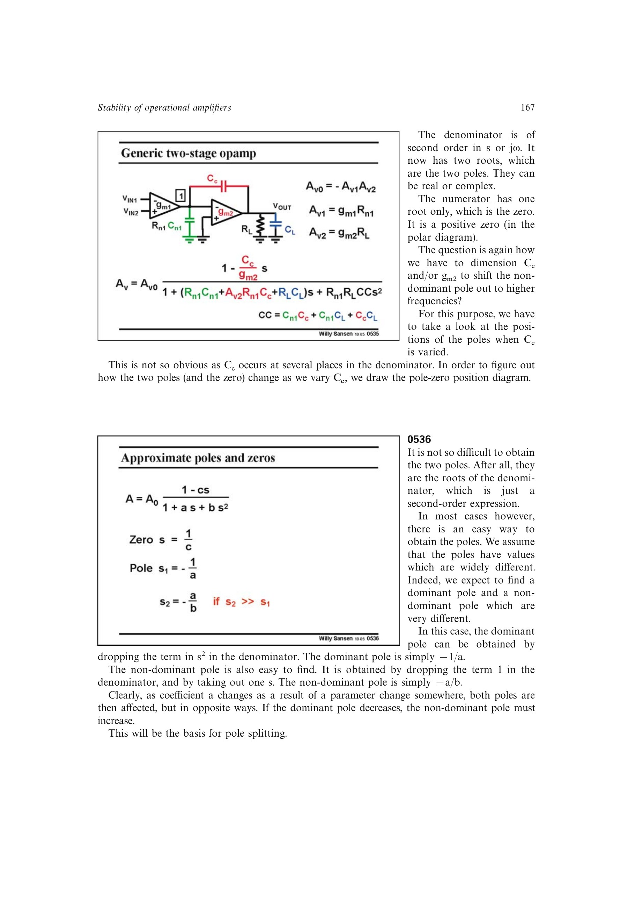

# 右半平面零点

普通 Miller 电容同时承载反馈电流和从输入节点直达输出的前馈电流。前馈输出与正常放大输出相位相反，在传递函数分子中形成右半平面正零点。

该零点的幅频作用像零点，但额外引入 `-90 deg` 相移，等效于稳定性上的另一个极点；单纯增大 `C_c` 会把它推向更低频，可能毁掉相位裕度。

来源：第 5 章 pp. 167-171，0535-0542。

## 原书图示

