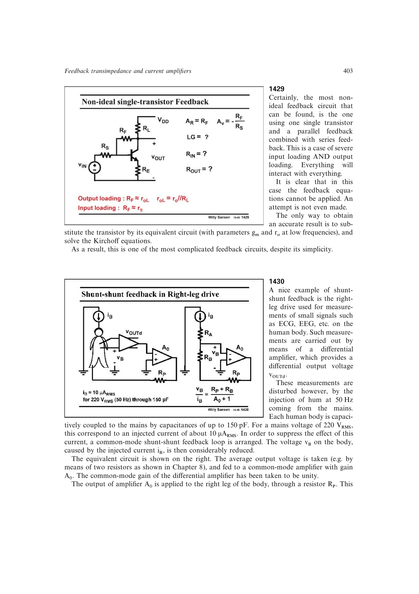

# 右腿驱动共模抑制

ECG/EEG 测量中，人体通过约 150 pF 的寄生电容接收 50 Hz 市电干扰。右腿驱动取差分放大器两输出的平均值，反相放大后经安全电阻注回人体，形成共模并并联反馈，使人体共模电压约按 `1+T` 降低。

串联保护电阻通常为 0.5-1 Mohm，远大于人体约 10 kohm 的等效电阻，必须在反馈抑制和故障安全之间同时满足要求。

来源：第 14 章 pp. 403-404，1430。

## 原书图示

