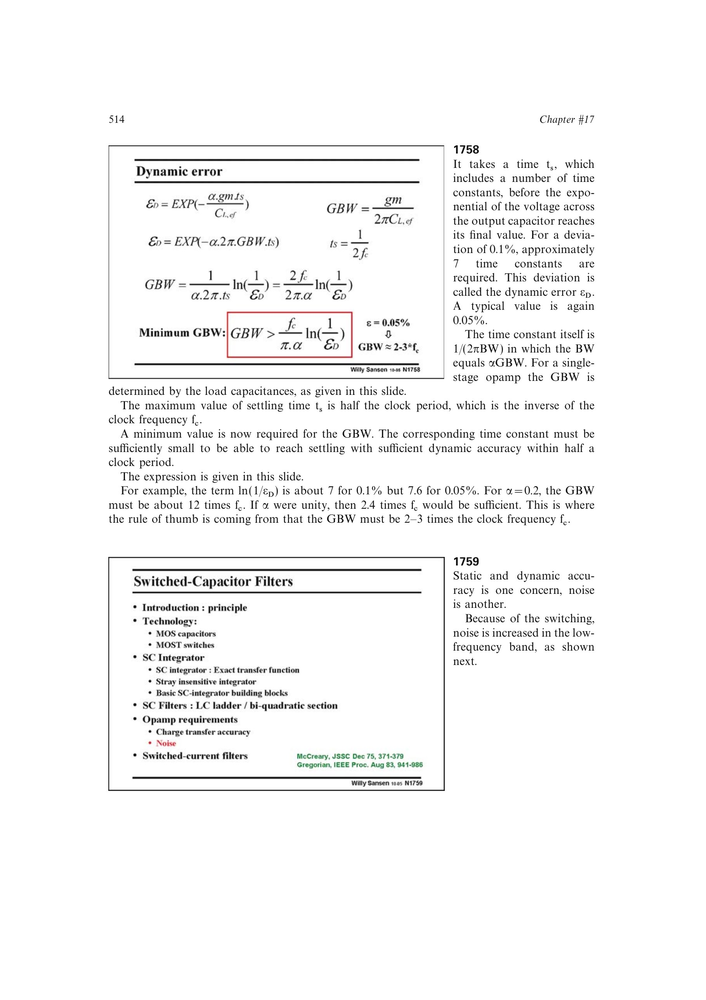

# 开关电容噪声折叠

运放带宽通常高于采样频率，时钟各整数倍附近的宽带噪声会混叠回基带。源书把基础积分噪声近似为 `kT/C`，再乘以 `GBW/(fc/2)`；当 `GBW约3fc` 时，噪声功率约放大 6 倍，电压噪声约放大 2.5 倍。

降低它需要增大电容，并把 GBW 控制在满足建立要求的最小值附近，而不是盲目追求带宽。

来源：第 17 章 pp. 514-515，图 17.59-17.60。

## 原书图示

