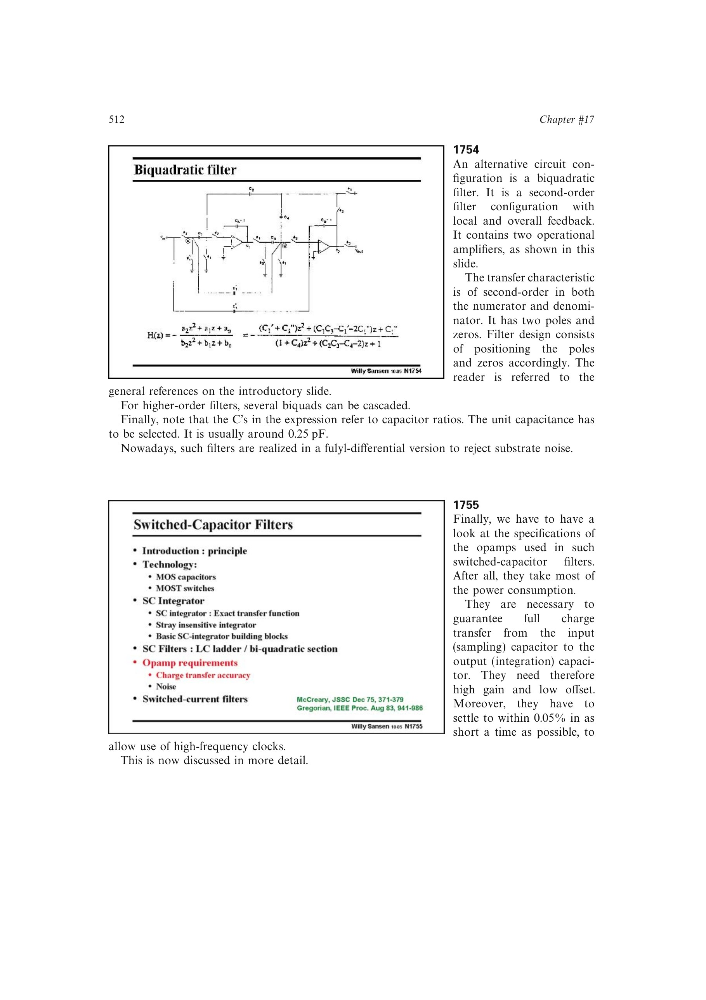

# 开关电容运放动态建立

单主极点闭环的动态误差为 `epsilonD=exp(-alpha*2pi*GBW*ts)`。若只允许半周期建立，`ts=1/(2fc)`，则

`GBW > [fc/(pi*alpha)]*ln(1/epsilonD)`。

单位反馈、0.05% 精度约要求 `GBW` 为 `2.4fc`；闭环增益 5（`alpha=0.2`）则约需 `12fc`。大阶跃还要同时检查压摆阶段。

来源：第 17 章 pp. 512-514，图 17.55-17.58。

## 原书图示

