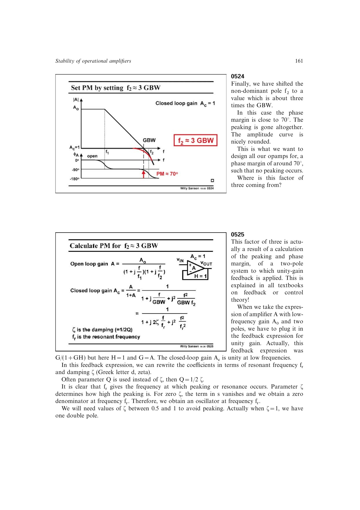

# 二阶阻尼

标准二阶闭环分母可由谐振频率与阻尼比 `zeta` 表示，品质因数 `Q=1/(2 zeta)`。`zeta` 过小产生谐振峰，`zeta≈0.7` 给出近似最大平坦响应，`zeta≈0.87` 可基本消除过冲。

在书中的两极点单位反馈近似里，非主极点与 GBW 的比值决定阻尼与相位裕度。

来源：第 5 章 pp. 161-163，0525-0528。

## 原书图示

