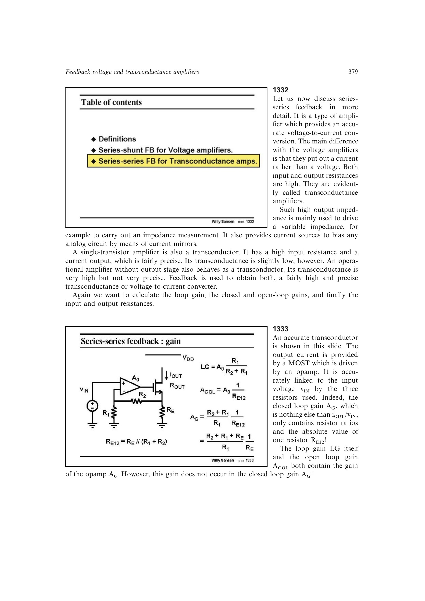

# 串串联跨导放大器

串串联反馈以输入电压驱动输出电流，输入与输出阻抗都随 `1+T` 提高。对运放驱动 MOS 的电阻反馈结构，令 `RE12=RE||(R1+R2)`，则 `T=A0*R1/(R1+R2)`，闭环跨导

`AG=((R1+R2)/R1)/RE12=((R1+R2+RE)/R1)/RE`。

开环跨导含 `A0`，闭环结果却只含电阻；输出开环阻抗约 `ro*(1+gm*RE12)`，再由全局反馈提高。

来源：第 13 章 pp. 379-380，1332-1334。

## 原书图示

